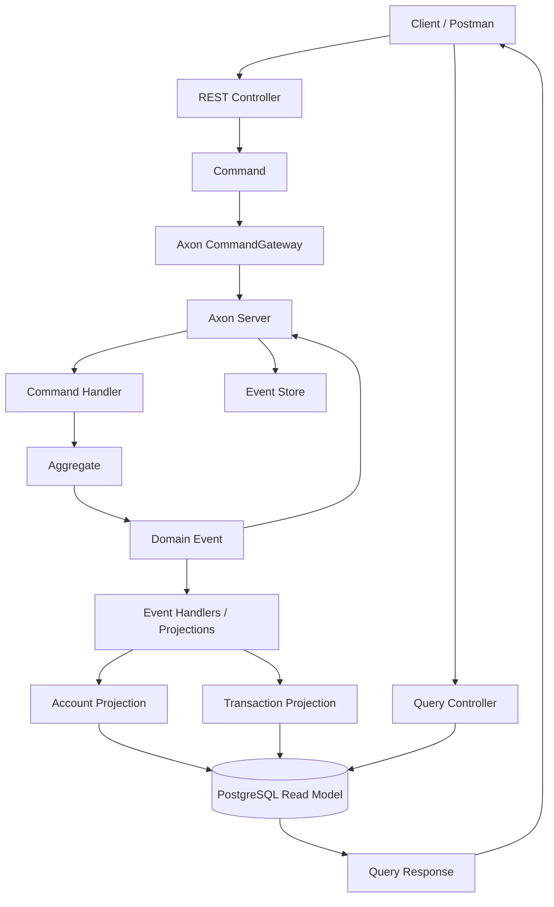

## Event Flow

The banking system follows CQRS and Event Sourcing principles using Axon Framework.

Commands are received through REST controllers and sent to Axon using the CommandGateway. Axon routes the commands to the appropriate command handler or aggregate.

The aggregate validates the business operation and generates domain events. These events are persisted by Axon and consumed by projection/event handlers.

The projection handlers update the PostgreSQL read model. Query controllers read the projected data and return it to the client.

This separates the command/write side from the query/read side and allows the read model to be rebuilt from the stored events.

### Messaging Infrastructure

The current implementation uses Axon Server for command routing and event handling. Kafka is not part of the current runtime implementation.